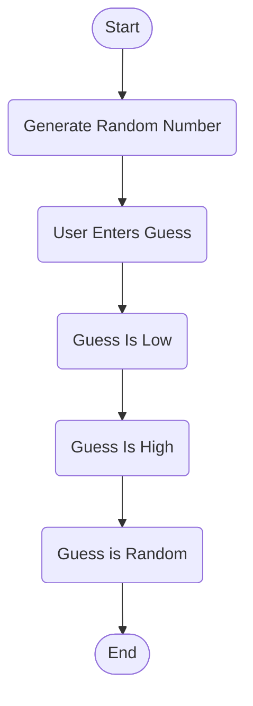

# Game Rundown
Player will start the game and the computer will then randomly generate a number. Once generated the player will have 5 attempts to guess a number between 1-50. After each guess the game will show you if your number was higher or lower than the random number. If you guess correctly you win!
